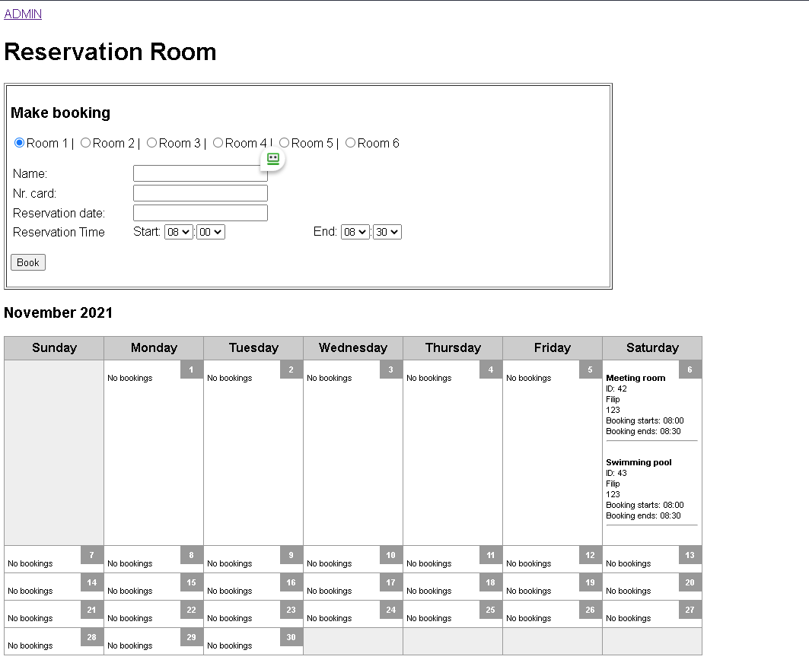

<ol>

Rzeczy do dopracowania:

<li style="font-weight: bold;"> Reservation time - mozliwość rezerwacji wstecz -> uniemożliwienie tego</li>
<li style="font-weight: bold;"> Checkboxy - każdy pokój swój checkbox </li>
<ul>
<li  style="color: yellow;">zaczete - male poprawki trzeba dokonac</li>
</ul>
<li style="font-weight: bold;"> Wklejenie schematu pokoi</li>
<li  style="font-weight: bold;"> Student o danym nr karty może zarezerwować tylko 3 razy w tygodniu pokój</li> 
<ul>
<li  style="color: yellow;">zaczete - male poprawki trzeba dokonac</li>
</ul>
<li style="font-weight: bold;"> 3 godziny max rezerwacji.</li>
<li style="font-weight: bold;"> System administracyjny</li>
<ul>
<li  style="color: yellow;">stworzony - dalsza modyfikacja</li>
</ul>
</ol>
