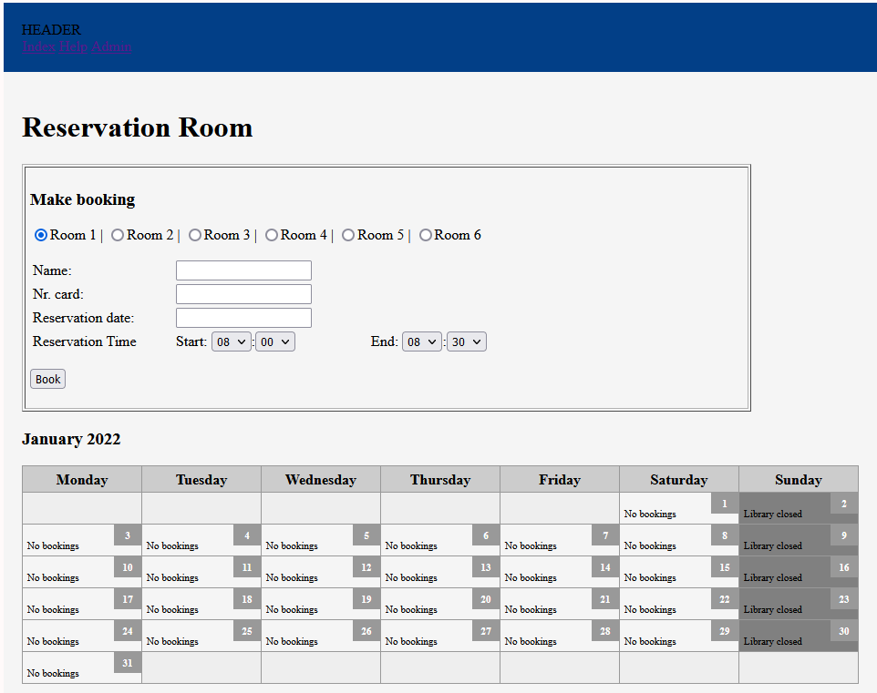
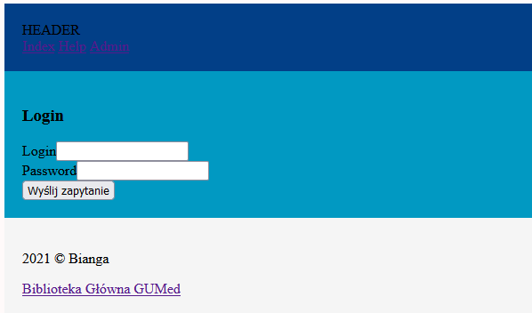
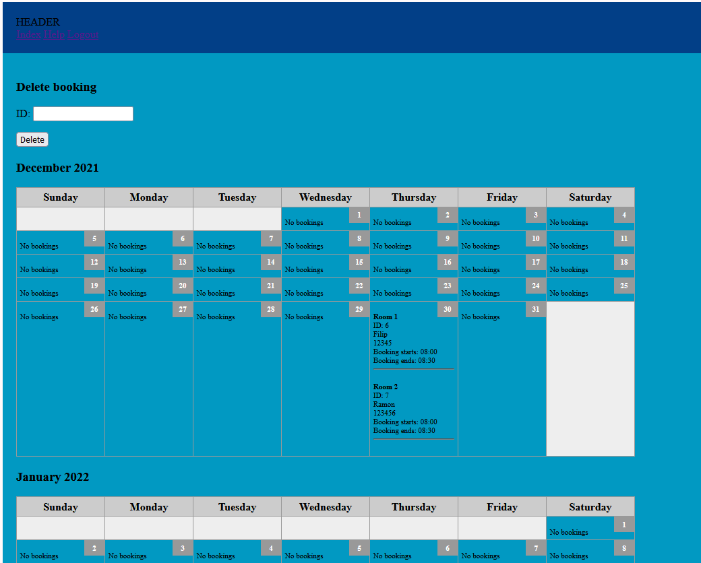

<h1 style="font-weight: bold;">Storzono nowy szkielet - MVC:</h1>

Co mamy na ten moment

<ol>
<li style="font-weight: bold;"> Podstawowy szkielet MVC na którym będziemy bazować</li>
<li style="font-weight: bold;"> Połączenie z baza i system logowania - admin </li>
<li style="font-weight: bold;"> Admin - usuwanie rekordów </li>
<li style="font-weight: bold;"> Widoki rozszerzone</li>
</ol>

<h3 style="font-weight: bold;">TODO</h3>

<ol>
<li style="font-weight: bold;"> Stworzenie modelu do wyświetlania kalendarza z zaznaczonymi rezerwacjami</li>
<li style="font-weight: bold;"> Panel administracyjnny z usuwaniem i modyfikowaniem pól </li>
<li style="font-weight: bold;"> Dołączenie grafiki pokoi</li>
<li style="font-weight: bold;"> Poprawa frontu</li>
</ol>